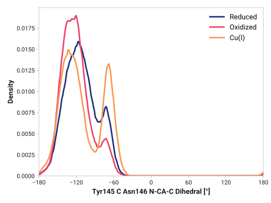
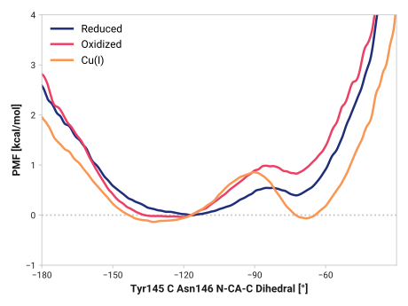

# i002-tyr145_c-asn146_n_ca_c

TODO:

## Probability density function

<figure markdown>

</figure>

### Quantitative

--8<-- "study/figures/i-tyr145/i002-tyr145_c-asn146_n_ca_c/pdf-info.md"

## Potential of mean force

<figure markdown>

</figure>

### Quantitative

--8<-- "study/figures/i-tyr145/i002-tyr145_c-asn146_n_ca_c/pmf-info.md"
