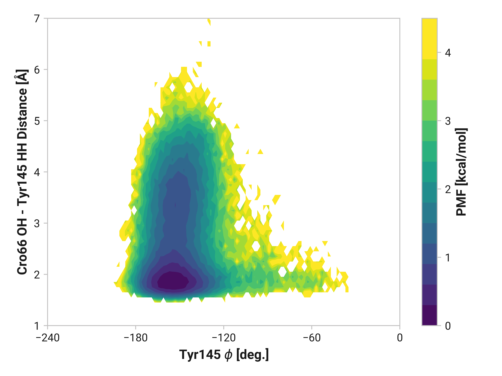

# i003-tyr145-phi-dist

## Probability densities

!!! quote "Reduced"
    <figure markdown>
    
    </figure>

!!! quote "Oxidized"
    <figure markdown>
    
    </figure>

!!! quote "Cu(I)"
    <figure markdown>
    
    </figure>

## Differences

!!! quote "Oxidized vs. reduced"
    <figure markdown>
    
    </figure>

!!! quote "Cu(I) vs. reduced"
    <figure markdown>
    
    </figure>
