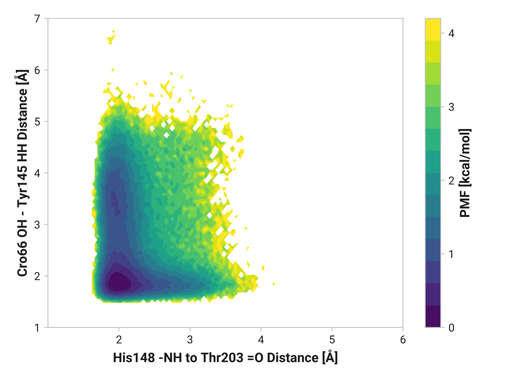

# I008: Tyr145 HH bonding to Cro66-OH vs. Asn146-O

## Potential of mean force

=== "Reduced"

    <figure markdown>
    
    </figure>

=== "Oxidized"

    <figure markdown>
    
    </figure>

=== "Cu(I)"

    <figure markdown>
    
    </figure>

## Visualization

