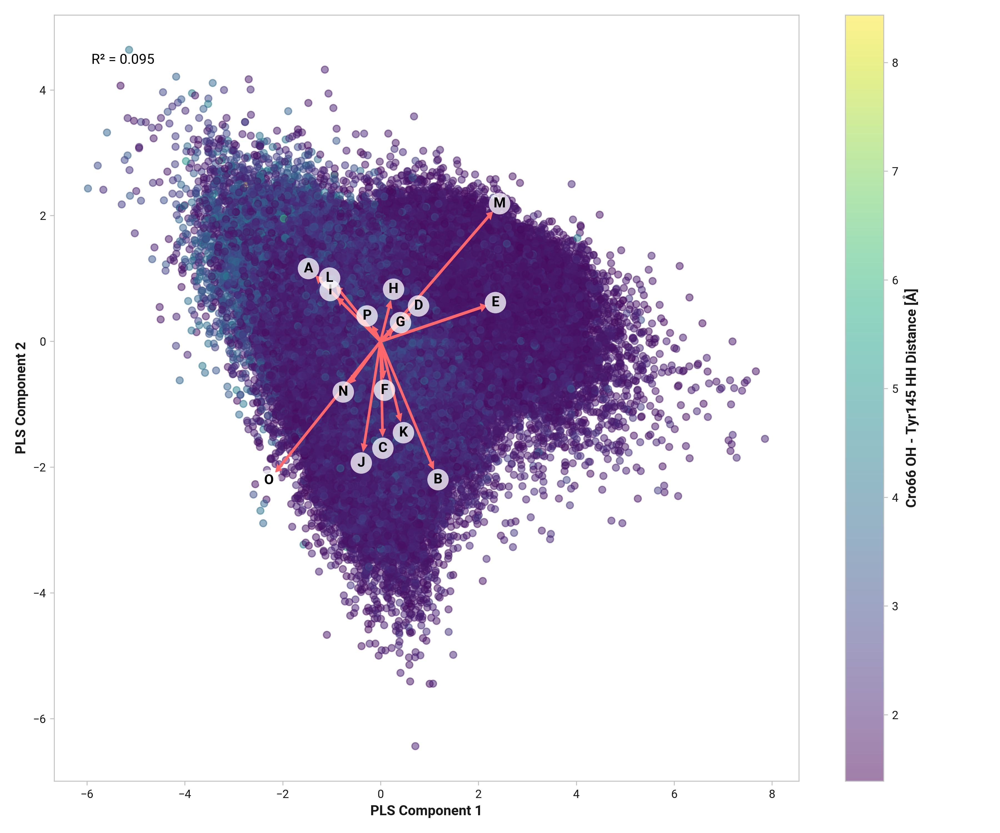
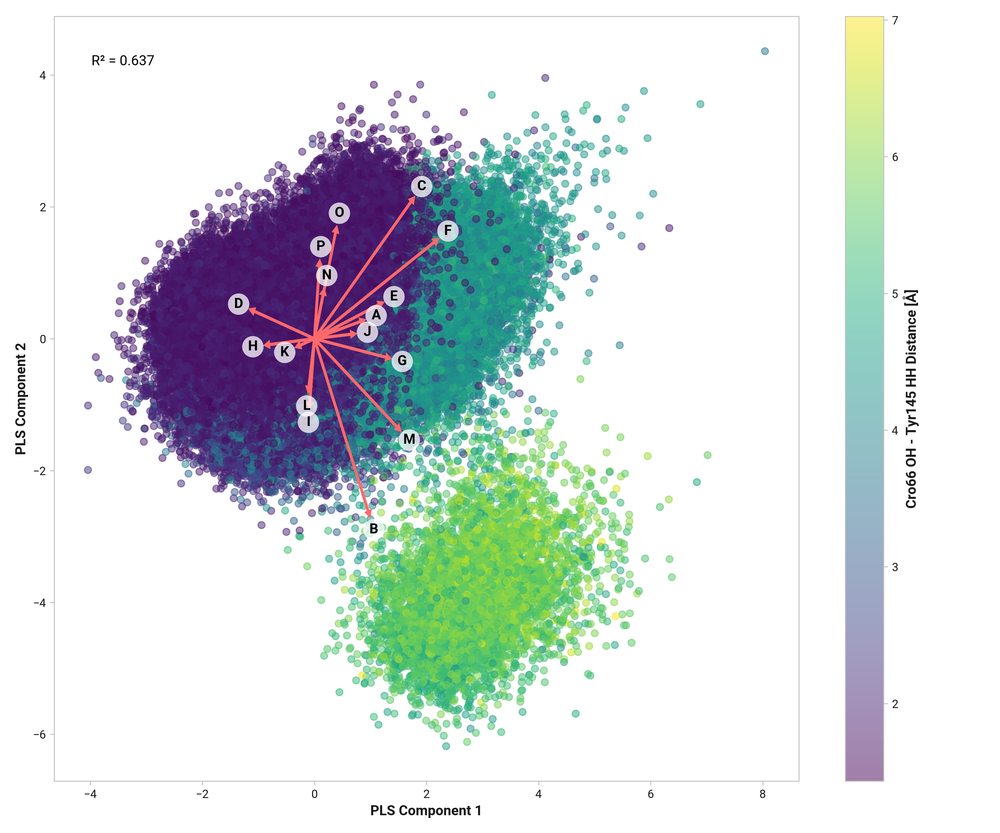

# I011: Dihedral importance

TODO:

## Visualization

## Feature correlation

=== "Reduced"
    <figure markdown>
    { width=700 }
    </figure>

=== "Oxidized"
    <figure markdown>
    { width=700 }
    </figure>

=== "Cu(I)"
    <figure markdown>
    { width=700 }
    </figure>

Key PLS Regression Plot:

-   **A**: tyr143_ca_cb_cg_cd1-dihedral_cos
-   **B**: tyr143_ce1_cz_oh_hh-dihedral_cos
-   **C**: tyr143_n_ca_c-asn144_n-dihedral_cos
-   **D**: cys145_n_ca_c-his146_n-dihedral_cos
-   **E**: asn144_n_ca_c-cys145_n-dihedral_cos
-   **F**: tyr143_c-asn144_n_ca_c-dihedral_cos
-   **G**: cys145_c-his146_n_ca_c-dihedral_cos
-   **H**: his146_n_ca_c-asn147_n-dihedral_cos
-   **I**: cys202_c-ser203_n_ca_c-dihedral_cos
-   **J**: ser203_n_ca_c-ala204_n-dihedral_cos
-   **K**: ser200_c-thr201_n_ca_c-dihedral_cos
-   **L**: cro65_og1-glu220_he2-dist
-   **M**: his146_hd1-asn144_o-dist
-   **N**: his146_h-thr201_o-dist
-   **O**: ser203_h-asn144_o-dist
-   **P**: ser203_og-glu220_he2-dist

## Feature importance to ML model

=== "Reduced"
    --8<-- "study/figures/i-tyr145/i011-tyr145_hh-model/reduced-feature-report.md"

=== "Oxidized"
    --8<-- "study/figures/i-tyr145/i011-tyr145_hh-model/oxidized-feature-report.md"

=== "Cu(I)"
    --8<-- "study/figures/i-tyr145/i011-tyr145_hh-model/cu-feature-report.md"
