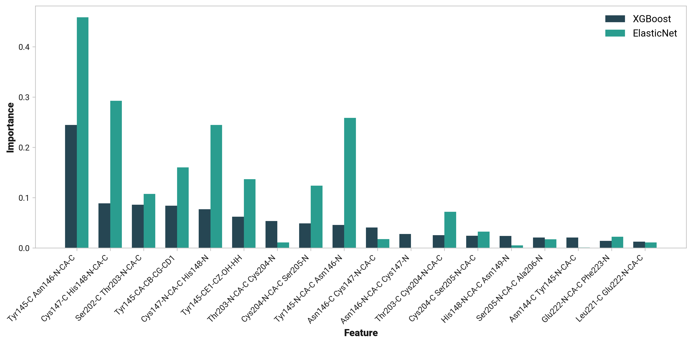
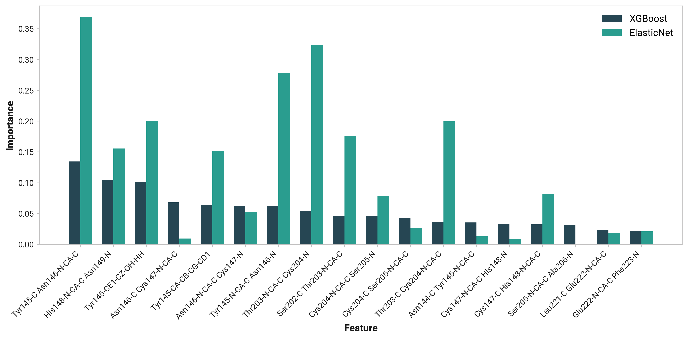
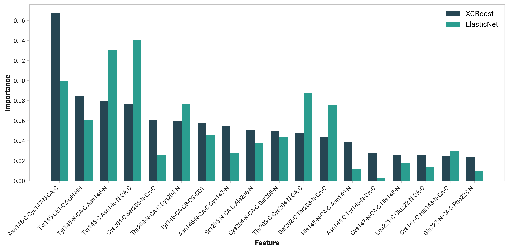
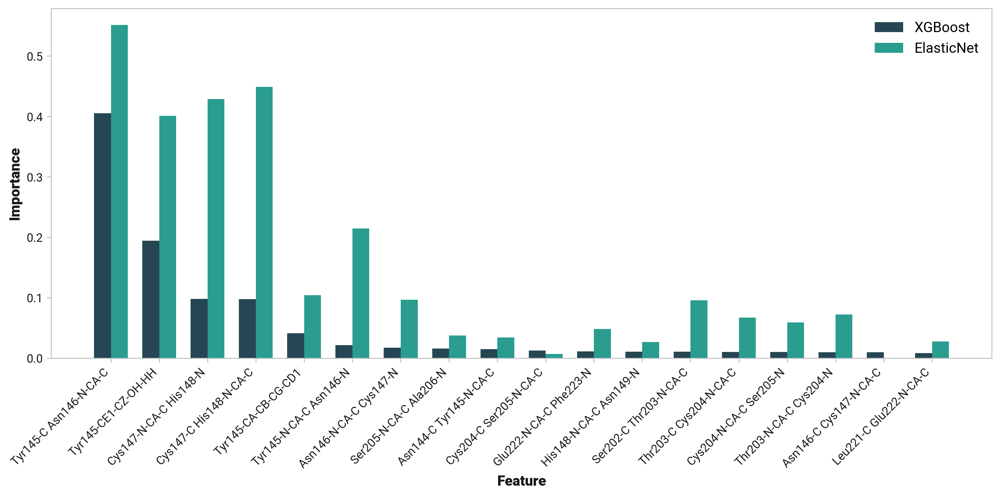

# I012: Cro66 and Tyr145 bonding with regression

TODO:

## Methodology

Dihedral angles were transformed using the function,

$$
\frac{1 - \cos \left(\theta\right)}{2}.
$$

This transformation maps the circular  dihedral data to a [0, 1] range, preserving the periodicity while differentiating between cis (0°) and trans (180°) conformations.
All input features ($X$) were standardized using sklearn's StandardScaler to ensure each feature contributes equally to the model.
The distance between Cro66 OH and His148 HD1 ($y$) was used as the response variable without scaling.

TODO: Regression

## Feature importance

=== "All"
    Regression on all states' trajectories.

    <figure markdown>
    { width=900 }
    </figure>

=== "Reduced"
    Regression on only trajectories from reduced simulations.

    <figure markdown>
    { width=900 }
    </figure>

=== "Oxidized"
    Regression on only trajectories from oxidized simulations.

    <figure markdown>
    { width=900 }
    </figure>

=== "Cu(I)"
    Regression on only trajectories from Cu(I) simulations.

    <figure markdown>
    { width=900 }
    </figure>

## Visualization

