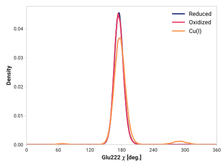
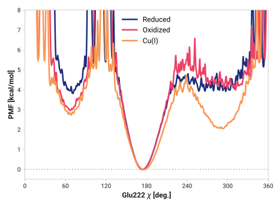

# j001-glu222_n_ca_cb_cg-pdf

TODO:

## Probability density function

<figure markdown>

</figure>

### Quantitative

--8<-- "study/figures/i-tyr145/j001-glu222_n_ca_cb_cg-pdf/pdf-info.md"

## Potential of mean force

<figure markdown>

</figure>

### Quantitative

--8<-- "study/figures/i-tyr145/j001-glu222_n_ca_cb_cg-pdf/pmf-info.md"
