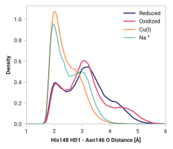

# L002: His148 HD1 - Asn146 O

## Probability density function

<figure markdown>
{ width=600 }
</figure>

### Hydrogen bonding

The following table presents the probability of the hydrogen bonding (within 2.5 Å).

| System | H bond |
| ------ | ------ |
| Reduced | 0.243 |
| Oxidized | 0.236 |
| Cu(I) | 0.606 |
| Na+ | 0.533 |

### Quantitative

--8<-- "study/figures/l-his148/l002-his148_hd1-asn146_o/pdf-info.md"

## Potential of mean force

<figure markdown>
{ width=600 }*
</figure>

### Quantitative

--8<-- "study/figures/l-his148/l002-his148_hd1-asn146_o/pmf-info.md"

## Visualization

