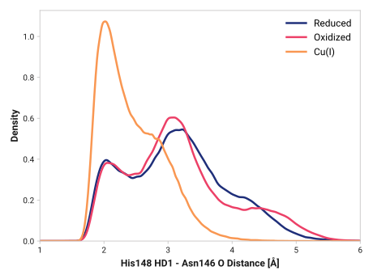
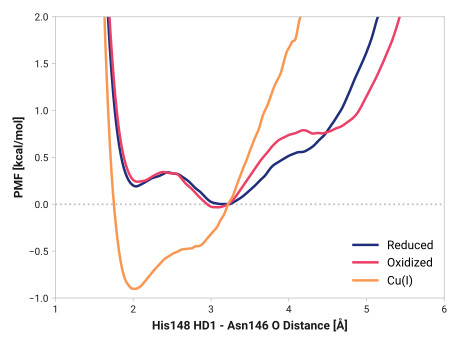

# l003-his148_hd1-asn146_o

TODO:

## Probability density function

<figure markdown>

</figure>

### Quantitative

--8<-- "study/figures/f-cys-beta/l003-his148_hd1-asn146_o/pdf-info.md"

## Potential of mean force

<figure markdown>

</figure>

### Quantitative

--8<-- "study/figures/f-cys-beta/l003-his148_hd1-asn146_o/pmf-info.md"
