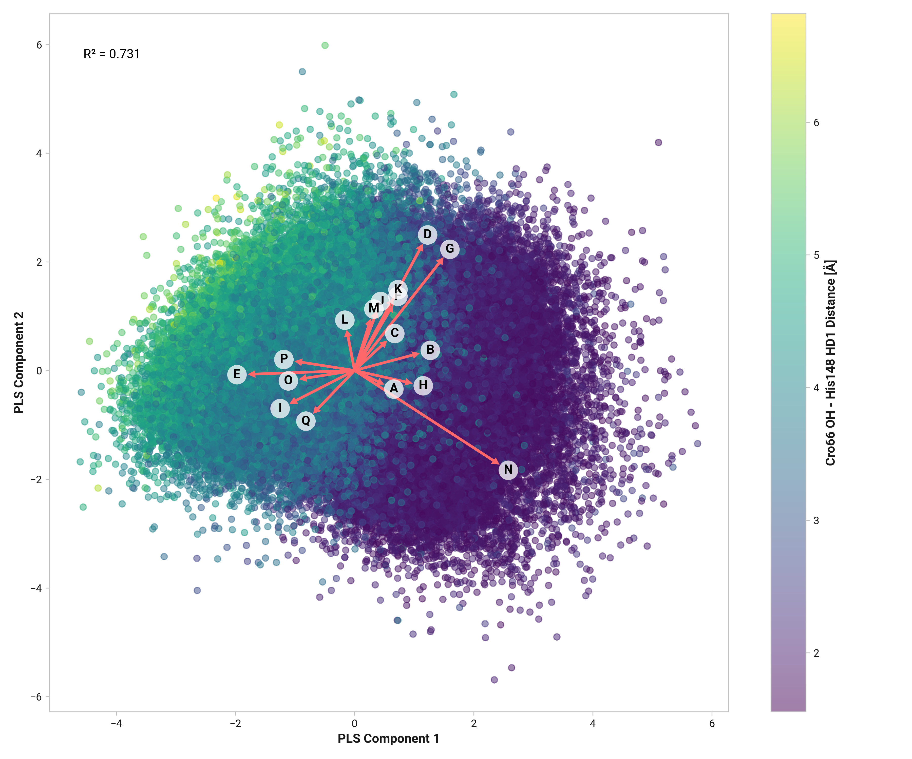

# L003: Feature importance

TODO:

## Visualization

## Feature correlation

=== "Reduced"
    <figure markdown>
    { width=700 }
    </figure>

=== "Oxidized"
    <figure markdown>
    { width=700 }
    </figure>

=== "Cu(I)"
    <figure markdown>
    { width=700 }
    </figure>

## Feature importance to ML model

=== "Reduced"
    --8<-- "study/figures/l-his148/l003-his148_hd1-model/reduced-feature-report.md"

=== "Oxidized"
    --8<-- "study/figures/l-his148/l003-his148_hd1-model/oxidized-feature-report.md"

=== "Cu(I)"
    --8<-- "study/figures/l-his148/l003-his148_hd1-model/cu-feature-report.md"
