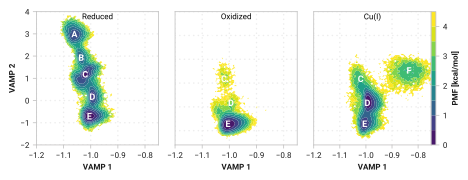

# Fig005

<figure markdown>
{width=900}
</figure>

> Potential of mean force (PMF) distributions in kcal/mol at 300 K of the three simulation conditions—Reduced, Oxidized, and Cu(I)—in the VAMP latent space with a time lag of 10 ps.
> Labels A through K are the 11 clusters from k-means on the concatenated VAMP latent space.
