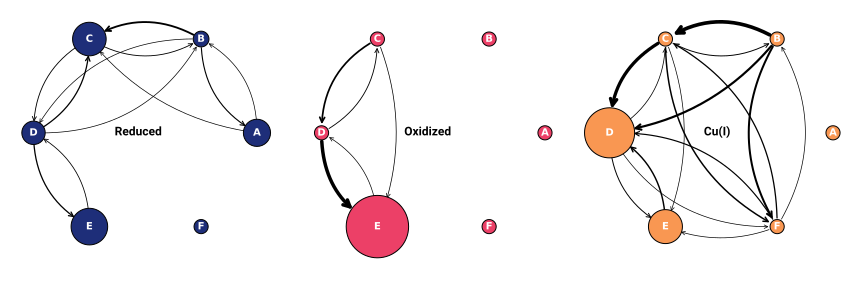

# Fig006

<figure markdown>
{width=800}
</figure>

> Markov networks from state trajectories for the three simulation conditions—Reduced, Oxidized, and Cu(I)—after k-means clustering of the VAMP latent space with a time lag of 10 ps.
> Transition counts are normalized to yield probabilities, retaining only transitions with probabilities >0.008 and state occupancies >0.0003.
> Nodes are scaled by normalized occupancy and edges by square-root-transformed transition probabilities.
