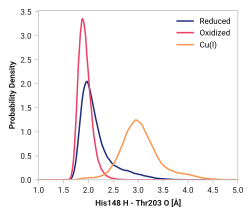

# Fig008

## Probability density function

<figure markdown>
{width=600}
</figure>

### Hydrogen bonding

The following table presents the probability of the hydrogen bonding (within 2.5 Å).

| System | H bond |
| ------ | ------ |
| Reduced | 0.865 |
| Oxidized | 0.997 |
| Cu(I) | 0.063 |

### Quantitative

--8<-- "study/figures/f-backbone/f001-his148_h-thr203_o/pdf-info.md"
