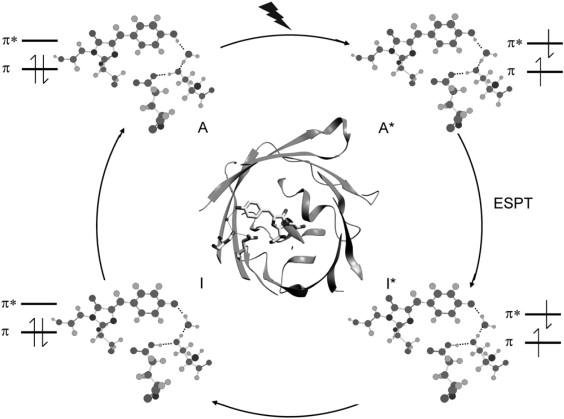

---
tags:
  - lit, gfp/mechanism, gfp/chromophore
date: 2008-01-01
---

# Balance between ultrafast parallel reactions in the green fluorescent protein has a structural origin

**Authors:** Jasper J. van Thor, Kate L. Ronayne, Michael Towrie, J. Timothy Sage

**DOI:** [10.1529/biophysj.108.129957](https://doi.org/10.1529/biophysj.108.129957)

<!-- more -->

Takeaways:

- 

## Abstract

> The fluorescence photocycle of the green fluorescent protein is functionally dependent on the specific structural protein environment. A direct relationship between equilibrium protein side-chain conformation of glutamate 222 and reactivity is established, particularly the rate of ultrafast proton transfer reactions in the fluorescence photocycle. We show that parallel transformations in the photocycle have a structural origin, and we report on the vibrational properties of responsive amino acids on an ultrafast timescale. Blue excitation of GFP drives two parallel, excited-state deuteron transfer reactions with 10 ps and 75 ps time constants to the buried carboxylic acid side chain of glutamate 222 via a hydrogen-bonding network. Assignment of 1456 cm−1 and 1441 cm−1 modes to _ν_sym and assignment of 1564 cm−1 and 1570 cm−1 features to _ν_asym of E222 in the 10 ps and 75 ps components, respectively, was possible from the analysis of the transient absorption data of an E222D mutant and was consistent with photoselection measurements. In contrast to the wild-type, measurements of E222D can be described with only one difference spectrum, with the _ν_sym mode at 1435 cm−1 and the _ν_asym mode at 1567 cm−1, also correlating a large Δ_ν_asym-sym with slow excited-state proton transfer kinetics. Density Functional Theory calculations and published model compound and theoretical studies relate differences in Δ_ν_asym-sym to the strength and number of hydrogen-bonding interactions that are detected via equilibrium geometry and COO− stretching frequency differences of the carboxylate. The correlation of photocycle kinetics with side-chain conformation of the acceptor suggests that proton transfer from S205 to E222 controls the rate of the overall excited-state proton transfer process, which is consistent with recent theoretical predictions. Photoselection measurements show agreement for localized C O vibrations of chromophore, Q69, and E222 with Density Functional Theory and ab initio calculations placed in the x-ray geometry and provide their vibrational response in the intermediates in the photocycle.

## Main

!!! quote "**Figure 1**"

    <figure markdown>
    { width=700 }
    </figure>
