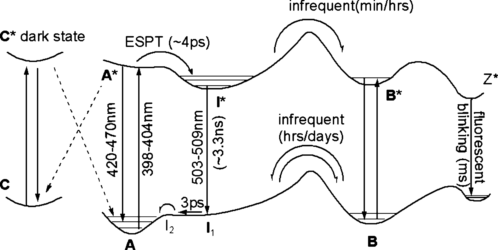
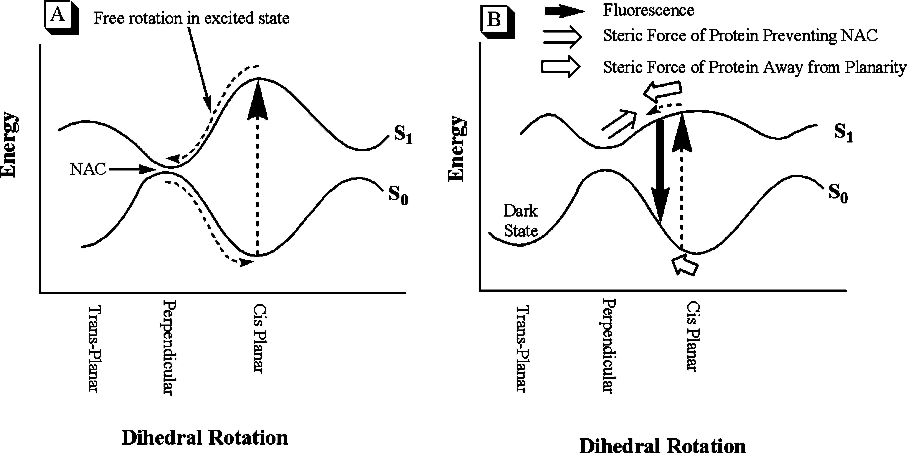

---
tags:
  - lit
date: 2008-01-01
---

# Photophysics and dihedral freedom of the chromophore in yellow, blue, and green fluorescent protein

**Authors:** Colleen M. Megley, Luisa A. Dickson, Scott L. Maddalo, Gabriel J. Chandler, Marc Zimmer

**DOI:** [10.1021/jp806285s](https://doi.org/10.1021/jp806285s)

<!-- more -->

Takeaways:

-

## Abstract

> Green fluorescent protein (GFP) and GFP-like fluorescent proteins owe their photophysical properties to an autocatalytically formed intrinsic chromophore.
> According to quantum mechanical calculations, the excited state of chromophore model systems has significant dihedral freedom, which may lead to fluorescence quenching intersystem crossing.
> Molecular dynamics simulations with freely rotating chromophoric dihedrals were performed on green, yellow, and blue fluorescent proteins in order to model the dihedral freedom available to the chromophore in the excited state.
> Most current theories suggest that a restriction in the rotational freedom of the fluorescent protein chromophore will lead to an increase in fluorescence brightness and/or quantum yield.
> According to our calculations, the dihedral freedom of the systems studied (BFP > A5 > YFP > GFP) increases in the inverse order to the quantum yield.
> In all simulations, the chromophore undergoes a negatively correlated hula twist (also known as a bottom hula twist mechanism).

## Main

!!! quote "**Figure 2**"

    <figure markdown>
    { width=700 }
    </figure>

!!! quote "**Figure 3**"

    <figure markdown>
    { width=700 }
    </figure>
