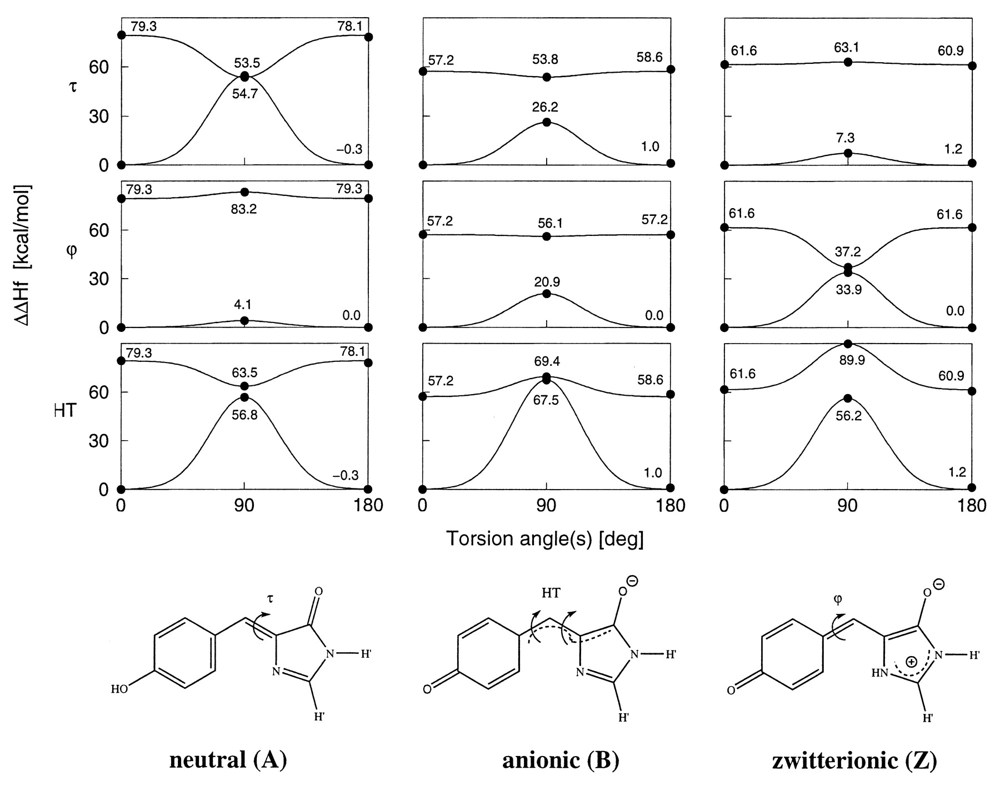
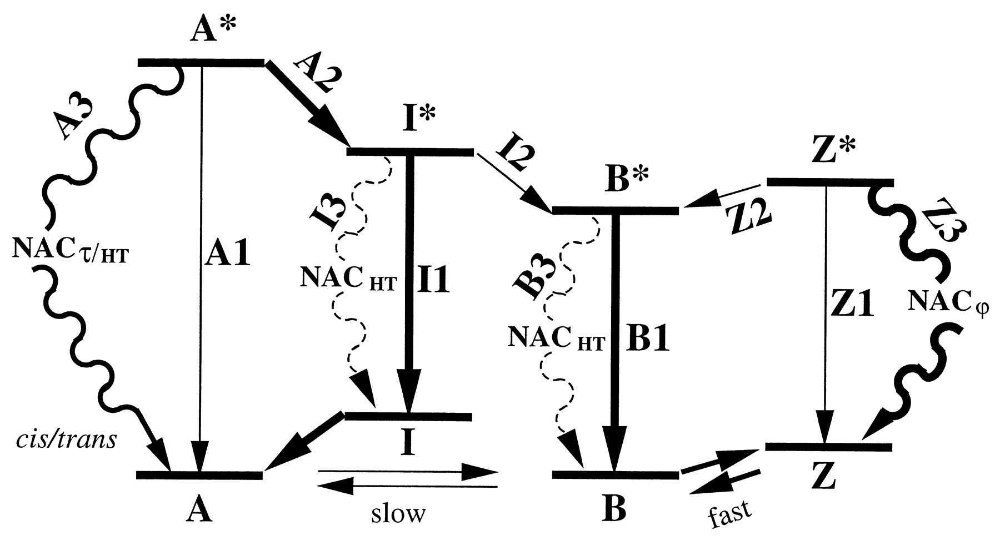

---
tags:
  - lit, gfp/mechanism, gfp/chromophore
date: 1999-05-25
---

# Shedding light on the dark and weakly fluorescent states of green fluorescent proteins

**Authors:** Wolfgang Weber, Volkhard Helms, J. Andrew McCammon, Peter W. Langhoff

**DOI:** [10.1073/pnas.96.11.6177](https://doi.org/10.1073/pnas.96.11.6177)

<!-- more -->

Takeaways:

-   Quantum chemical analysis on wild-type GFP chromophore.
-   GFP chemical environment keeps chromophore in a planar conformation.
-   Chromophore can dissipate the excited electron through a thermal (i.e., vibrational) process instead of radiative (i.e., fluoresce) if it takes a perpendicular conformation.

## Abstract

> Recent experiments on various similar green fluorescent protein (GFP) mutants at the single-molecule level and in solution provide evidence of previously unknown short- and long-lived “dark” states and of related excited-state decay channels.
> Here, we present quantum chemical calculations on cis-trans photoisomerization paths of neutral, anionic, and zwitterionic GFP chromophores in their ground and first singlet excited states that explain the observed behaviors from a common perspective.
> The results suggest that favorable radiationless decay channels can exist for the different protonation states along these isomerizations, which apparently proceed via conical intersections.
> These channels are suggested to rationalize the observed dramatic reduction of fluorescence in solution.
> The observed single-molecule fast blinking is attributed to conversions between the fluorescent anionic and the dark zwitterionic forms whereas slow switching is attributed to conversions between the anionic and the neutral forms.
> The predicted nonadiabatic crossings are seen to rationalize the origins of a variety of experimental observations on a common basis and may have broad implications for photobiophysical mechanisms in GFP.

## Main

> Theory shows that conical intersections can mediate facile conformational changes by nonadiabatic crossing (NAC) between different adiabatic potential surfaces, totally quenching fluorescence and other competing decay mechanisms. (1)

1.  The sentence discusses the role of conical intersections in the excited-state dynamics of the Green Fluorescent Protein (GFP) chromophore.
    Conical intersections are regions in the potential energy landscape where two or more electronic states have the same energy and are degenerate, forming a cone-like shape around the intersection point.
    These intersections can facilitate rapid and efficient transitions between different molecular geometries or conformations, allowing a molecule to easily switch from one electronic state to another, leading to a change in its structure.

    The transition between different electronic states that occurs at a conical intersection is called a nonadiabatic crossing (NAC).
    This term refers to the fact that the transition does not follow the Born-Oppenheimer approximation, which assumes that electronic and nuclear motions can be separated.
    Instead, at a conical intersection, the electronic and nuclear motions are strongly coupled.
    The adiabatic potential surfaces, which describe the energy of a molecule as a function of its nuclear coordinates under the Born-Oppenheimer approximation, meet at the conical intersection.

    When a molecule undergoes a nonadiabatic transition at a conical intersection, it can rapidly convert the excited-state energy into vibrational energy, effectively "quenching" the fluorescence.
    This means that the molecule returns to the ground state without emitting a photon, and other decay processes, such as fluorescence or phosphorescence, are suppressed.

!!! quote "**Figure 1**"

    <figure markdown>
    { width=700 }
    </figure>

!!! quote "**Figure 2**"

    <figure markdown>
    { width=700 }
    </figure>
